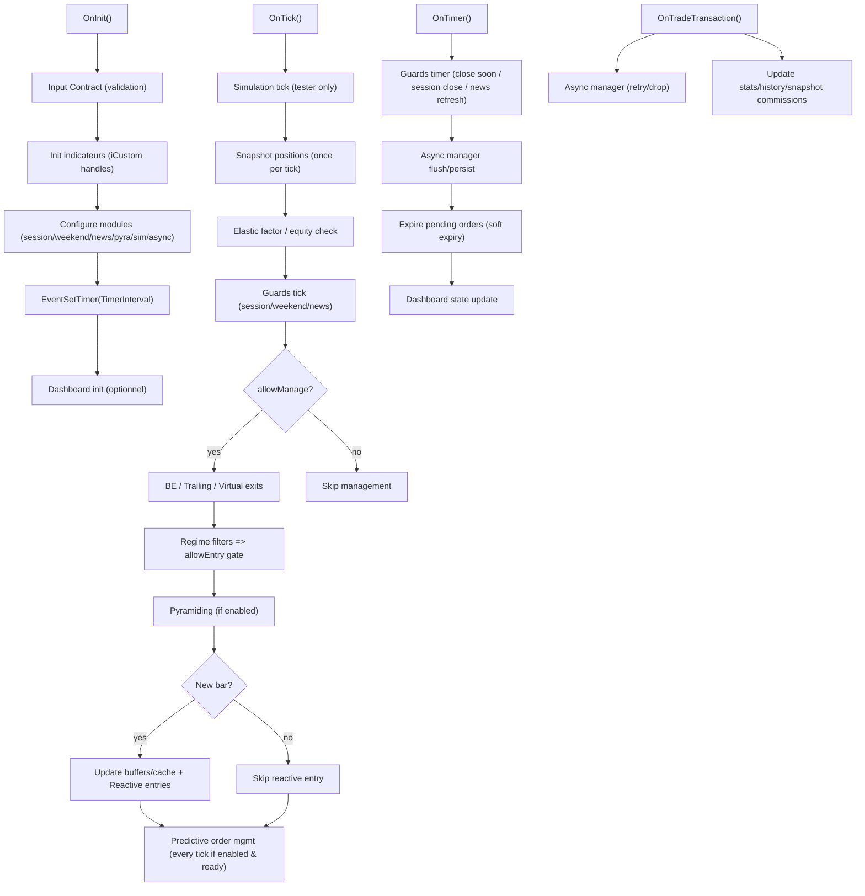

# Modèle événementiel (OnInit / OnTick / OnTimer / OnTradeTransaction)

## Objectif

Décrire les responsabilités de chaque événement et le flux principal.

## Source-of-truth

- `MQL5/Experts/Aurora.mq5` (`OnInit`, `OnTick`, `OnTimer`, `OnTradeTransaction`)
- Doc legacy : `DOCS/legacy/Aurora_Documentation.md` (section “Modèle événementiel”)

## Schéma fonctionnel (vue d’ensemble)

## Rôles (résumé)

- `OnInit` : valide inputs, init indicateurs, configure modules, démarre timer, init dashboard.
- `OnTick` : chemin critique (snapshot, guards, management sorties), décision entrée, reactive (new bar) + predictive (continu).
- `OnTimer` : refresh news, guards time-based, flush/persist async, nettoyage pendings, dashboard update.
- `OnTradeTransaction` : feedback asynchrone, retries, mise à jour stats/snapshot.

## See also

- Contrat d’inputs : `../inputs/input-contract.md`
- Async manager : `internals/async-order-manager.md`

## Last verified
Last verified: 2026-02-15 — Méthode: lecture statique + comparaison avec `MQL5/Experts/Aurora.mq5` (AURORA_VERSION=3.44).

