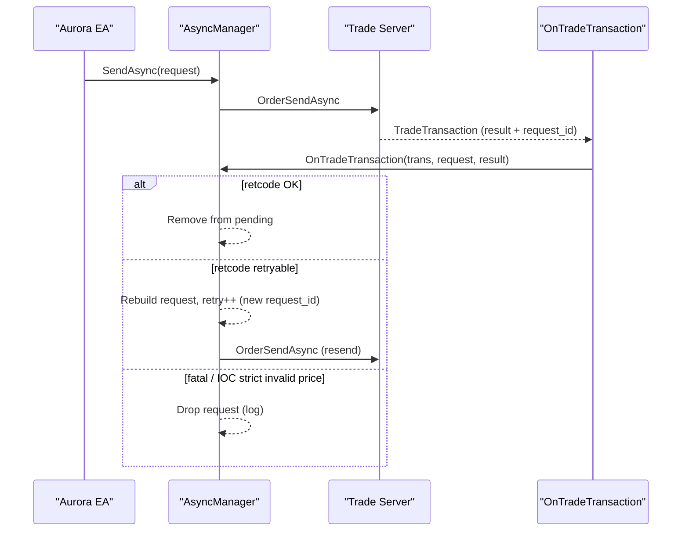

# Internal — Async order manager

## Objectif

Documenter le rôle du manager asynchrone (`OrderSendAsync`) et ses invariants observables (sans formules propriétaires).

## Source-of-truth

- `MQL5/Include/Aurora/aurora_async_manager.mqh`
- Doc legacy : `DOCS/legacy/Aurora_Documentation.md` (section “Async Order Manager”)

## Principes (résumé)

- Envoi via `OrderSendAsync` (non-bloquant), traitement dans `OnTradeTransaction`.
- Déduplication : évite d’empiler des requêtes identiques “in flight”.
- Retry policy : retries limités, abandon sur erreurs fatales.
- Persistence live : persistance des requêtes “en vol” via `FILE_COMMON` (via `aurora_state_manager.mqh`).

## Schéma

## See also

- Modèle événementiel : `../event-model.md`

