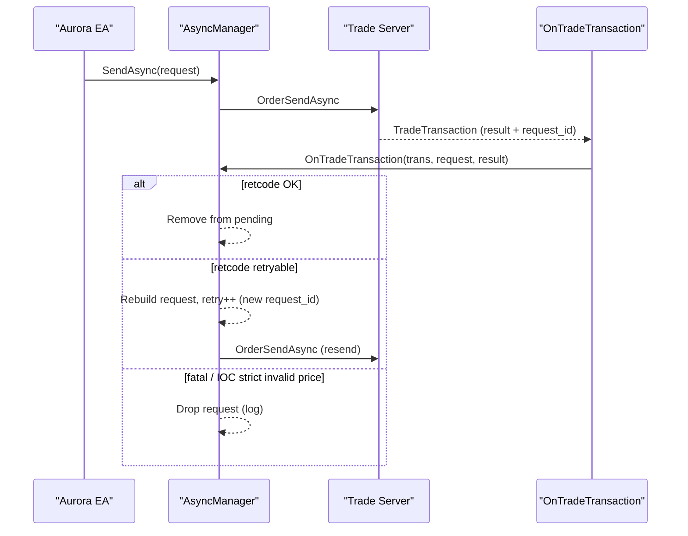
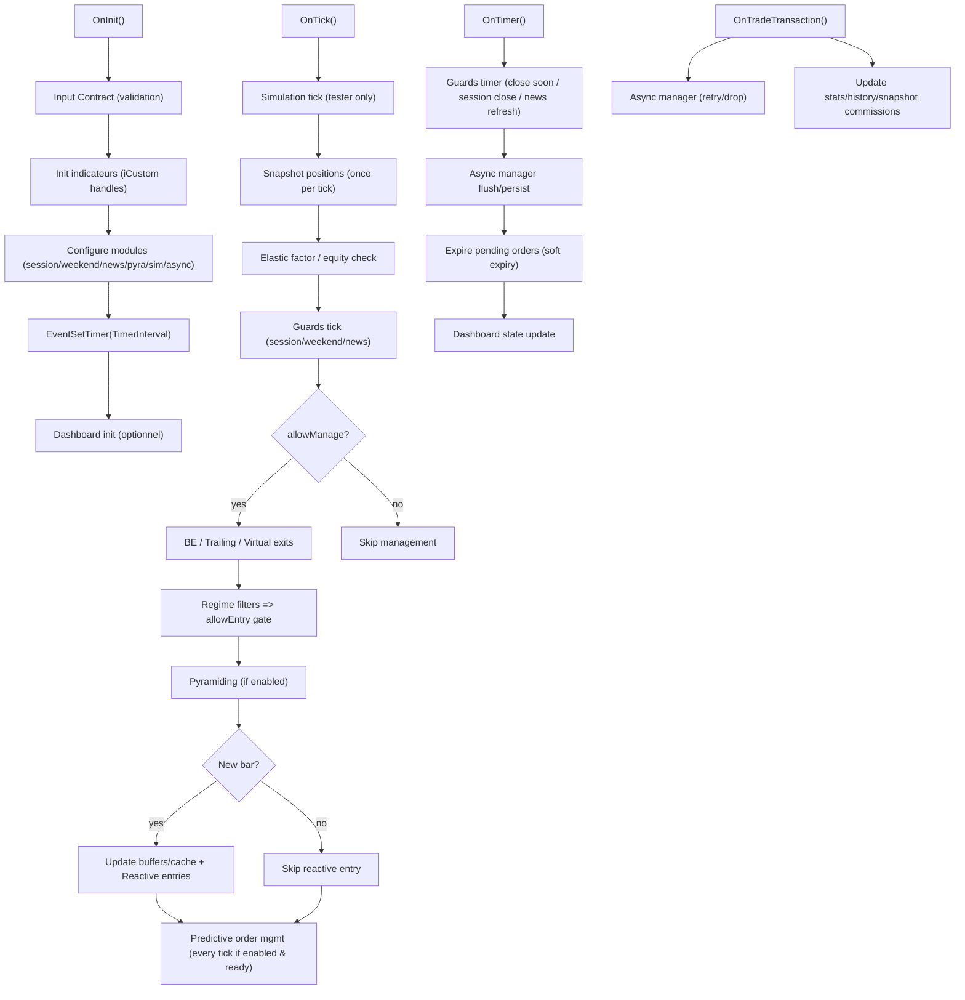

# Manuel Technique — Aurora EA (MetaTrader 5 / MQL5)

**EA :** Aurora  
**Version (code) :** `3.43` (référence : `AURORA_VERSION` dans `MQL5/Experts/Aurora.mq5`)  
**Dernière mise à jour :** 6 février 2026  
**Format :** Markdown (compatible PDF)  
**Licence :** Propriétaire (usage restreint)  

---

## Sommaire

1. [Objectif & périmètre](#1-objectif--périmètre)  
2. [Installation & compilation](#2-installation--compilation)  
3. [Architecture technique](#3-architecture-technique)  
   1. [Modules (Include)](#31-modules-include)  
   2. [Indicateurs (Indicators)](#32-indicateurs-indicators)  
   3. [Ressources embarquées (#resource)](#33-ressources-embarquées-resource)  
   4. [Mécanismes internes (technique)](#34-mécanismes-internes-technique)  
4. [Modèle événementiel (OnInit/OnTick/OnTimer/OnTradeTransaction)](#4-modèle-événementiel-oninitontickontimerontradetransaction)  
5. [Stratégies & exécution (hybride)](#5-stratégies--exécution-hybride)  
   1. [Choix du core (SuperTrend / Momentum)](#51-choix-du-core-supertrend--momentum)  
   2. [Choix de l’exécution (Reactive / Predictive)](#52-choix-de-lexécution-reactive--predictive)  
   3. [Guards & filtres de régime](#53-guards--filtres-de-régime)  
   4. [Sorties (SL/Trailing/BE/Exit-on-close)](#54-sorties-sltrailingbeexit-on-close)  
   5. [Pyramidage (TrendScale)](#55-pyramidage-trendscale)  
6. [Input contract (règles de cohérence)](#6-input-contract-règles-de-cohérence)  
7. [Dictionnaire complet des inputs](#7-dictionnaire-complet-des-inputs)  
8. [Logs & diagnostic](#8-logs--diagnostic)  
9. [Backtest & simulation réaliste](#9-backtest--simulation-réaliste)  
10. [Dépannage / FAQ](#10-dépannage--faq)  
11. [Annexes](#11-annexes)  
   1. [Enums (référence)](#111-enums-référence)  
   2. [Glossaire](#112-glossaire)  

---

## 1. Objectif & périmètre

Aurora est un EA MQL5 **événementiel** et **modulaire** conçu pour être :
- **Rapide** sur le chemin critique (`OnTick`) : calculs regroupés “once per tick / once per bar”, snapshot, async orders.
- **Robuste** en production : pipeline de guards (sessions/weekend/news), limitations de risque, contrat d’inputs (refus d’init en cas d’incohérence).
- **Testable** : couche optionnelle de simulation dans le Strategy Tester (latence, slippage, rejections, spread padding).

Cette documentation est une **doc technique complète** :
- Architecture, modules, schémas fonctionnels, dépendances.
- Dictionnaire exhaustif des inputs **v3.43**.
- Explication “hybride” de la logique : ce que fait chaque composant et comment ils s’enchaînent, sans divulguer de formules propriétaires.

---

## 2. Installation & compilation

### 2.1 Prérequis
- MetaTrader 5 (build récent recommandé, typiquement **4000+**).
- Accès à MetaEditor pour compiler.
- VPS recommandé pour exécution 24/5 (ceci reste un prérequis d’exploitation, pas de compilation).

### 2.2 Point critique : indicateurs embarqués en `.ex5`

Aurora embarque des indicateurs via `#resource` en **référençant des `.ex5`** (pas les `.mq5`).  
Conséquence : **si les `.ex5` n’existent pas**, la compilation de l’EA échouera.

### 2.3 Procédure standard (depuis les sources de ce repo)
1. Copier le dossier `MQL5/` dans le dossier de données MT5 (`Fichier → Ouvrir le dossier de données`).
2. Dans MetaEditor, **compiler** les indicateurs dans `MQL5/Indicators/Aurora/` :
   - `Heiken_Ashi.mq5`
   - `ChandelierExit.mq5`
   - `ZLSMA.mq5`
   - `AuKeltnerKama.mq5`
   - `Hurst.mq5`
   - `VWAP.mq5`
   - `Kurtosis.mq5`
   - `TrapCandle.mq5`
   - (optionnel) `ATR_HeikenAshi.mq5`
3. Compiler l’EA : `MQL5/Experts/Aurora.mq5`.
4. Dans MT5 : attacher `Aurora` à un graphique et activer **Algo Trading**.

### 2.4 Presets `.set`
Le dossier `MQL5/Presets/` contient des presets historiques. **Ils peuvent être antérieurs à la v3.43** : utilisez-les comme point de départ uniquement et vérifiez les inputs.

---

## 3. Architecture technique

### 3.1 Modules (Include)

Aurora est structuré en modules `MQL5/Include/Aurora/` :

- `aurora_engine.mqh` : cœur (helpers marché, exécution, gestion trailing/BE/exit-on-close, logique des ordres)
- `aurora_trade_contract.mqh` : contrat d’API d’exécution partagé (helpers prix/filling/order) pour découpler les includes
- `aurora_guard_pipeline.mqh` : pipeline de guards (sessions/weekend/news) pour `OnTick` + `OnTimer`
- `aurora_async_manager.mqh` : gestion `OrderSendAsync`, déduplication, retries, persistence
- `aurora_state_manager.mqh` : persistence du state async (`FILE_COMMON`, binaire)
- `aurora_snapshot.mqh` : snapshot positions en un passage + agrégats (profit/volume/exposition)
- `aurora_virtual_stops.mqh` : stops virtuels (visuels + niveaux en mémoire) pour exit-on-close/anti-wick
- `aurora_simulation.mqh` : simulation “reality check” (tester) : latence/slippage/rejections/spread padding
- `aurora_newsfilter.mqh` + `aurora_news_core.mqh` : news filter sur **MT5 Economic Calendar**
- `aurora_session_manager.mqh` : horaires (2 fenêtres), jours, close mode, respect sessions broker, deleverage
- `aurora_weekend_guard.mqh` : protection gap week-end basée sur les sessions broker
- `aurora_pyramiding.mqh` : pyramidage (scaling-in) + trailing groupé (points/ATR)
- `aurora_dashboard.mqh` : dashboard Canvas + rendu + interactions
- `aurora_time.mqh` : clock/time helpers (abstractions temps)
- `aurora_logger.mqh` : logging (catégories par flags)
- `aurora_error_utils.mqh` : descriptions retcodes/erreurs
- `aurora_types.mqh` : enums + structs (inputs/state/simulation/async)
- `aurora_constants.mqh` : constantes globales

#### Entrypoints (appelés depuis `Aurora.mq5`)

Cette table résume les points d’intégration “publics” entre l’EA et ses modules.

| Module | Type(s) principal(aux) | Entrypoints (exemples) | Appelé depuis |
|---|---|---|---|
| `aurora_engine.mqh` | `GerEA` | `Init()`, `Deinit()`, trailing/BE/virtual exits, helpers d’exécution | `OnInit`, `OnTick`, `OnTimer`, `OnDeinit` |
| `aurora_guard_pipeline.mqh` | `AuroraGuards` | `ProcessTick(...)`, `ProcessTimer(...)` | `OnTick`, `OnTimer` |
| `aurora_async_manager.mqh` | `CAsyncOrderManager` | `Configure(...)`, `SendAsync(...)`, `OnTradeTransaction(...)`, `FlushState(...)` | `OnInit`, `OnTimer`, `OnTradeTransaction`, `OnDeinit` |
| `aurora_state_manager.mqh` | `CStateManager` | `SaveState(...)`, `LoadState(...)`, `ClearState()` | via `CAsyncOrderManager` |
| `aurora_snapshot.mqh` | `CAuroraSnapshot` | `Update(...)`, `Invalidate()`, agrégats profit/volume | `OnTick`, `OnTradeTransaction` |
| `aurora_newsfilter.mqh` | `CAuroraNewsFilter` | `Configure(...)`, `OnTimer()`, `FreezeNow(...)`, `ShouldCloseNow(...)`, `GetUpcomingEvents(...)` | `OnInit`, `OnTick`, `OnTimer` |
| `aurora_session_manager.mqh` | `CAuroraSessionManager` | `Configure(...)`, `AllowTrade(...)`, `ShouldClosePositions(...)`, `GetDeleverageAbsTarget(...)` | `OnTick`, `OnTimer` |
| `aurora_weekend_guard.mqh` | `CAuroraWeekendGuard` | `Configure(...)`, `ShouldCloseSoon(...)`, `BlockEntriesNow(...)` | `OnTick`, `OnTimer` |
| `aurora_pyramiding.mqh` | `CAuroraPyramiding` | `Configure(...)`, `Process(...)` | `OnInit`, `OnTick` |
| `aurora_dashboard.mqh` | `CAuroraDashboard` | `Init(...)`, `Update(...)`, `OnEvent(...)`, `Destroy()` | `OnInit`, `OnTimer`, `OnDeinit`, `OnChartEvent` |
| `aurora_virtual_stops.mqh` | `CVirtualStopManager` | `Set(...)`, `Get(...)`, `Clean(...)`, `ClearAll()` | via `GerEA` / sorties |
| `aurora_simulation.mqh` | `CAuroraSimulation` | `Init(...)`, `OnTick()`, virtuel pending fill | `OnInit`, `OnTick` |
| `aurora_time.mqh` | `AuroraClock` | `Now()`, helpers day/minutes | partout (temps) |
| `aurora_logger.mqh` | `CAuroraLogger` | `IsEnabled(...)`, `Info*` / `Warn*` / `Error*` | partout (logs) |
| `aurora_error_utils.mqh` | helpers | `TradeServerReturnCodeDescription(...)` | logs ordres / retcodes |
| `aurora_types.mqh` | enums/structs | `SSessionInputs`, `SNewsInputs`, `SSimulationInputs`, enums | compilation + config modules |
| `aurora_constants.mqh` | macros | `AURORA_BUFF_SIZE`, `AURORA_TIMER_MIN_SEC`, etc. | compilation + guards |

### 3.2 Indicateurs (Indicators)

Aurora utilise des indicateurs internes (dans `MQL5/Indicators/Aurora/`) via `iCustom` + `CopyBuffer`.

| Indicateur | Rôle principal | Inputs (indicateur) |
|---|---|---|
| `Heiken_Ashi` | Série lissée Heiken Ashi (source possible du signal) | (standard) |
| `ZLSMA` | Filtre tendance “zero-lag” | `LRPeriod`, `HeikenAshi` |
| `ChandelierExit` | Contexte tendance / stops dynamiques (ATR) | `ATRPeriod`, `ATRMult` |
| `AuKeltnerKama` | Momentum / canal dynamique basé KAMA + ATR + ER | `InpKama_*`, `InpATR_*` |
| `Hurst` | Filtre de structure (trend vs noise) | `InpWindow`, `InpSmoothing`, `InpThreshold` |
| `VWAP` | Déviation vs VWAP (structure) | `InpDeviation` |
| `Kurtosis` | Détection de “fat tails” (extrêmes) | `InpWindow`, `InpThreshold` |
| `TrapCandle` | Filtre anti “trap / stop-hunt” | wick/body, body pts, etc. |
| `ATR_HeikenAshi` | ATR calculé sur séries HA | `InpAtrPeriod` |

#### Paramétrage exact (v3.43) : appels `iCustom` et buffers lus

Référence : initialisation des handles dans `MQL5/Experts/Aurora.mq5` (section “STRATEGY INITIALIZATION”) et lectures via `CopyBuffer`.

- `Heiken_Ashi` (`MQL5/Indicators/Aurora/Heiken_Ashi.mq5`)
  - Appel : `iCustom(NULL, 0, I_HA)`
  - Inputs indicateur : aucun
  - Buffers lus : `HA_C` (buffer index 3 dans l’EA)
  - Utilisation : source de signal/filtrage (SuperTrend) selon `InpSignal_Source`.

- `ChandelierExit` (`MQL5/Indicators/Aurora/ChandelierExit.mq5`)
  - Appel : `iCustom(NULL, 0, I_CE, CeAtrPeriod, CeAtrMult)`
  - Inputs indicateur : `ATRPeriod`, `ATRMult`
  - Buffers lus :
    - `CE_B` : `CopyBuffer(CE_handle, 0, ...)` (buy context)
    - `CE_S` : `CopyBuffer(CE_handle, 1, ...)` (sell context)

- `ZLSMA` (`MQL5/Indicators/Aurora/ZLSMA.mq5`)
  - Appel : `iCustom(NULL, 0, I_ZL, ZlPeriod, true)`
  - Inputs indicateur : `LRPeriod`, `HeikenAshi`
  - Buffers lus : `ZL` : `CopyBuffer(ZL_handle, 0, ...)`

- `AuKeltnerKama` (`MQL5/Indicators/Aurora/AuKeltnerKama.mq5`)
  - Appel : `iCustom(NULL, 0, I_AKKE, InpKeltner_KamaPeriod, InpKeltner_KamaFast, InpKeltner_KamaSlow, InpKeltner_AtrPeriod, InpKeltner_Mult)`
  - Inputs indicateur : `InpKama_*`, `InpATR_*`
  - Buffers lus :
    - `AKKE_Kama` : buffer 0
    - `AKKE_Dn` : buffer 1
    - `AKKE_Up` : buffer 2
    - `AKKE_Er` : buffer 3 (Efficiency Ratio export)

- `Hurst` (`MQL5/Indicators/Aurora/Hurst.mq5`)
  - Appel : `iCustom(_Symbol, InpHurst_Timeframe, I_HURST, InpHurst_Window, InpHurst_Smoothing, InpHurst_Threshold)`
  - Buffers lus : `Hurst_Buffer` : `CopyBuffer(Hurst_handle, 0, 1, 1, ...)` (index 1 = bougie confirmée)
  - Activation : `InpHurst_Enable` ou `InpStress_Enable`.

- `VWAP` (`MQL5/Indicators/Aurora/VWAP.mq5`)
  - Appel : `iCustom(_Symbol, PERIOD_CURRENT, I_VWAP, InpVWAP_DevLimit)`
  - Buffers lus :
    - `VWAP_Upper` : `CopyBuffer(VWAP_handle, 1, 1, 1, ...)`
    - `VWAP_Lower` : `CopyBuffer(VWAP_handle, 2, 1, 1, ...)`
  - Activation : `InpVWAP_Enable` ou `InpStress_Enable`.

- `Kurtosis` (`MQL5/Indicators/Aurora/Kurtosis.mq5`)
  - Appel : `iCustom(_Symbol, PERIOD_CURRENT, I_KURTOSIS, InpKurtosis_Period, InpKurtosis_Threshold)`
  - Buffers lus : `Kurtosis_Buffer` : `CopyBuffer(Kurtosis_handle, 0, 1, 1, ...)`
  - Activation : `InpKurtosis_Enable` ou `InpRegime_FatTail_Enable` ou `InpStress_Enable`.

- `TrapCandle` (`MQL5/Indicators/Aurora/TrapCandle.mq5`)
  - Appel : `iCustom(_Symbol, PERIOD_CURRENT, I_TRAP, InpTrap_WickRatio, InpTrap_MinBodyPts, 0.4, true, 3)`
  - Inputs indicateur disponibles : wick/body ratio, min body points, max close/open ratio, require prev trend, trend bars.
  - Important : en v3.43, seuls `InpTrap_WickRatio` et `InpTrap_MinBodyPts` sont exposés en inputs EA ; les paramètres `0.4`, `true`, `3` sont **codés en dur** côté EA.
  - Buffer lu : `Trap_Signal` : `CopyBuffer(Trap_handle, 2, 1, 1, ...)` (signal)

- `ATR_HeikenAshi` (`MQL5/Indicators/Aurora/ATR_HeikenAshi.mq5`)
  - Indicateur fourni dans le repo (ATR basé HA).
  - Non embarqué en `#resource` et non chargé par l’EA v3.43 par défaut.

### 3.3 Ressources embarquées (#resource)

Dans `MQL5/Experts/Aurora.mq5`, Aurora embarque :
- `Indicators\\Aurora\\Heiken_Ashi.ex5`
- `Indicators\\Aurora\\ChandelierExit.ex5`
- `Indicators\\Aurora\\ZLSMA.ex5`
- `Indicators\\Aurora\\AuKeltnerKama.ex5`
- `Indicators\\Aurora\\Hurst.ex5`
- `Indicators\\Aurora\\VWAP.ex5`
- `Indicators\\Aurora\\Kurtosis.ex5`
- `Indicators\\Aurora\\TrapCandle.ex5`

Dans `aurora_dashboard.mqh` :
- `\\Images\\Aurora_Icon.bmp`

Autres ressources liées :
- `MQL5/Experts/Aurora.mq5` définit aussi `#property icon "\\Images\\Aurora_Icon.ico"` (icône EA côté MT5).

---

### 3.4 Mécanismes internes (technique)

Cette section documente les briques “système” qui influencent le comportement en live et en backtest.

#### Async Order Manager (`aurora_async_manager.mqh`)

Objectif : accélérer l’exécution et gérer la réalité des retcodes serveur (retries, duplications, restarts).

Principes :
- Envoi via `OrderSendAsync` (non-bloquant), puis traitement du résultat dans `OnTradeTransaction`.
- Déduplication : évite d’empiler des requêtes identiques “in flight” (pendings/modify/remove/SLTP).
- Retry policy : retries limités (`MAX_ASYNC_RETRIES`) avec abandon sur erreurs fatales (volume invalide, no money, marché fermé…).
- Gestion “IOC strict” : si un ordre IOC “strict” est rejeté (prix/stops invalides), le manager abandonne pour éviter le slippage.

Persistence (live uniquement) :
- Le manager persiste la liste des requêtes en vol via `CStateManager` dans `FILE_COMMON`.
- TTL et trimming : les requêtes trop anciennes sont expulsées.
- Flush périodique : persiste seulement si “dirty” et selon un intervalle (anti-IO excessif).

Schéma :


#### Snapshot positions (`aurora_snapshot.mqh`)

Objectif : réduire les appels API répétitifs et fournir des agrégats cohérents “once per tick”.

Caractéristiques :
- `Update(magic, symbol)` parcourt `PositionsTotal()` une fois et remplit :
  - liste positions filtrées,
  - indices buys/sells,
  - agrégats : profit total, volume total, exposition nette.
- Cache commissions : `OnTradeTransaction` peut enrichir le cache via `AddCommission(...)` et forcer un `Invalidate()` après un deal.

#### News core (`aurora_news_core.mqh` + `aurora_newsfilter.mqh`)

Objectif : bloquer l’entrée/gestion autour d’événements macro via l’API calendrier de MT5.

Points techniques :
- Cache d’événements rafraîchi à cadence `InpNews_RefreshMin` via `OnTimer`.
- Fenêtres blackout `before/after` + noyau minimal renforcé pour les news fortes.
- Fallback neutre si API indisponible, avec throttling des probes pour limiter les spikes.

#### Weekend guard (`aurora_weekend_guard.mqh`)

Objectif : éviter les expositions juste avant un gros gap inter-session.

Principe :
- Reconstruit les sessions `SymbolInfoSessionTrade` sur plusieurs jours, calcule :
  - `gap_min` entre close et réouverture,
  - `time_to_close_min`.
- Si `gap_min >= InpWeekend_GapMinHours*60` :
  - “close soon” si `time_to_close_min <= InpWeekend_BufferMin`
  - “block entries” si `time_to_close_min <= InpWeekend_BlockNewBeforeMin`

---

## 4. Modèle événementiel (OnInit/OnTick/OnTimer/OnTradeTransaction)

### 4.1 Schéma fonctionnel (vue d’ensemble)



### 4.2 Rôles par événement
- `OnInit` :
  - valide les inputs (contrat),
  - initialise les handles indicateurs,
  - configure les modules,
  - démarre le timer,
  - initialise le dashboard (si activé).
- `OnTick` :
  - chemin critique : snapshot, guards tick, management (BE/trailing/exits), décision entrée,
  - mise à jour “once per bar” des buffers indicateurs + caches,
  - exécution reactive sur nouvelle bougie + exécution predictive en continu.
- `OnTimer` :
  - gestion globale et rafraîchissement news,
  - fermeture week-end “close soon”, nettoyage pendings expirés,
  - mise à jour dashboard.
- `OnTradeTransaction` :
  - feedback asynchrone (réussite/échec), retries si pertinent,
  - mise à jour compteurs (trades/jour) et cache commissions snapshot.

---

## 5. Stratégies & exécution (hybride)

### 5.1 Choix du core (SuperTrend / Momentum)

Aurora propose deux cœurs de signal (input `InpStrategy_Core`) :

#### Core “SuperTrend”
Composants :
- `Chandelier Exit` (ATR) pour le contexte tendance
- `ZLSMA` comme filtre directionnel
- Source du signal configurable (`InpSignal_Source`) :
  - Heiken Ashi (lissé),
  - prix réel,
  - mode adaptatif (hybride selon volatilité).

Mode adaptatif (inputs `InpAdaptive_*`) :
- fait varier la sensibilité (période ZLSMA et/ou multiplicateur CE) en fonction de mesures de “bruit / volatilité”.

#### Core “Momentum”
Composant :
- `AuKeltnerKama` (canal dynamique KAMA + ATR) + ER
Paramètres :
- `InpKeltner_*` + (optionnel) `InpSmartMom_*` pour rendre les canaux dynamiques.

### 5.2 Choix de l’exécution (Reactive / Predictive)

`InpEntry_Strategy` :
- **Reactive (`STRATEGY_REACTIVE`)** : décisions sur **nouvelle bougie** (anti-flicker), entrée via `InpEntry_Mode` :
  - `ENTRY_MODE_MARKET` (au marché),
  - `ENTRY_MODE_LIMIT` (strict, IOC),
  - `ENTRY_MODE_STOP` (breakout).
- **Predictive (`STRATEGY_PREDICTIVE`)** : gestion d’ordres en attente *mise à jour en continu* :
  - calcule des niveaux “cibles” (buy/sell) et met à jour les pendings si variation > `InpPredictive_Update_Threshold`,
  - offset paramétrable en points ou ATR (`InpPredictive_Offset_Mode`, `InpPredictive_Offset`, `InpPredictive_ATR_*`),
  - peut déclencher une exécution immédiate si le prix a déjà franchi un niveau (selon logique interne).

### 5.3 Guards & filtres de régime

Aurora applique des “gates” avant d’autoriser :
- l’**entrée** (`allowEntry`)
- la **gestion** (BE/trailing/exits) (`allowManage`)
- la purge d’ordres en attente (`guardPurgePending`)

Guards principaux :
- **Session manager** : jours autorisés + 2 fenêtres horaires (A/B) + close modes
- **Weekend guard** : blocage entrées avant close + close “soon” + purge pendings (optionnel)
- **News filter** : blackout avant/après news via **calendrier économique MT5**

Filtres de régime (inputs `InpStress_*`, `InpHurst_*`, `InpVWAP_*`, `InpKurtosis_*`, `InpTrap_*`, `InpRegime_*`) :
- Objectif : réduire le risque d’entrée dans des contextes “toxiques” (bruit extrême, spikes, fat tails, structures non favorables).
- Ils affectent typiquement `allowEntry` (bloque des entrées) sans nécessairement bloquer la gestion des positions en cours.

### 5.4 Sorties (SL/Trailing/BE/Exit-on-close)

Stop Loss :
- `IgnoreSL` : si `true`, SL non envoyé au broker (gestion virtuelle / interne selon logique).
- `InpSL_Mode` :
  - points fixes,
  - deviation,
  - ATR (dynamique),
  - deviation ATR.

Trailing :
- `TrailingStop` + `TrailMode` (`STANDARD`, `FIXED_POINTS`, `ATR`)
- `TrailingStopLevel` ou `TrailFixedPoints` ou `TrailAtr*` selon le mode.

Break-even :
- `InpBE_*` (ratio, points, ATR) + `InpBE_OnNewBar` pour limiter la variabilité.

Exit-on-close (anti-wick) :
- `InpExit_OnClose` : active la logique “sortie sur clôture”
- `aurora_virtual_stops.mqh` conserve des niveaux virtuels et peut dessiner des repères sur le graphique.

### 5.5 Pyramidage (TrendScale)

Module `aurora_pyramiding.mqh` :
- Ajoute des couches de positions en tendance si conditions remplies
- Trailing de groupe configurable (points / ATR)
- Contrôlé par `TrendScale_*`

---

## 6. Input contract (règles de cohérence)

Aurora valide un ensemble de règles au démarrage. En cas de violation, l’EA :
- logge la liste des violations,
- affiche une alerte,
- **refuse l’initialisation**.

Exemples de règles :
- Sessions : au moins un jour actif si `OpenNewPos=true`.
- News :
  - si `InpNews_Enable=true` alors `InpNews_Levels != NEWS_LEVELS_NONE` et bornes minutes valides,
  - si `InpNews_Enable=false` alors `InpNews_Action` doit être `NEWS_ACTION_MONITOR_ONLY`.
- Dashboard : `InpDash_NewsRows` et `InpDash_Scale` dans les bornes.
- Simulation : bornes sur latence/slippage/rejection prob, et `InpSim_StartTicket >= VIRTUAL_TICKET_START`.

### 6.1 Liste exhaustive des règles (v3.43)

Source : messages d’erreur `RequireInput(..., errors, "...")` dans `MQL5/Experts/Aurora.mq5`.

> Les libellés ci-dessous sont ceux qui apparaissent dans le journal en cas de refus d’init.

```text
[RISK] RiskMode invalide
[EXEC] MagicNumber doit être > 0
[EXEC] TimerInterval doit être dans [1..3600]
[EXEC] InpEntry_Dist_Pts doit être >= 0
[EXEC] InpEntry_Expiration_Sec doit être >= 0
[PRED] InpPredictive_Update_Threshold doit être >= 0
[PRED] InpPredictive_Offset doit être >= 0 en mode POINTS
[PRED] InpPredictive_ATR_Period doit être >= 1 en mode ATR
[PRED] InpPredictive_ATR_Mult doit être > 0 en mode ATR
[EXEC] InpEntry_Dist_Pts doit être > 0 en mode REACTIVE+STOP
[RISK] Risk doit être > 0 en mode FIXED_VOL/MIN_AMOUNT
[RISK] Risk (%) doit être dans ]0..100]
[RISK] InpMaxDailyTrades doit être -1 ou > 0
[RISK] InpMaxLotSize doit être -1 ou > 0
[RISK] InpMaxTotalLots doit être -1 ou > 0
[RISK] SpreadLimit doit être -1 ou > 0
[RISK] SignalMaxGapPts doit être -1 ou > 0
[RISK] Slippage doit être >= 0
[RISK] EquityDrawdownLimit doit être dans [0..100]
[RISK] InpVirtualBalance doit être -1 ou > 0
[RISK] Risk (lot fixe) ne doit pas dépasser InpMaxLotSize
[RISK] InpMaxTotalLots doit être >= InpMaxLotSize
[SUPER] CeAtrPeriod doit être >= 1
[SUPER] CeAtrMult doit être > 0
[SUPER] ZlPeriod doit être >= 2
[SUPER] InpAdaptive_ER_Period doit être >= 2
[SUPER] InpAdaptive_ZLS_MinPeriod doit être >= 2
[SUPER] InpAdaptive_ZLS_MaxPeriod doit être >= MinPeriod
[SUPER] InpAdaptive_ZLS_Smooth doit être dans ]0..1]
[SUPER] InpAdaptive_Vol_ShortPeriod doit être >= 2
[SUPER] InpAdaptive_Vol_LongPeriod doit être > ShortPeriod
[SUPER] InpAdaptive_CE_MinMult doit être > 0
[SUPER] InpAdaptive_CE_MaxMult doit être >= MinMult
[SUPER] InpAdaptive_CE_BaseMult doit être > 0
[SUPER] InpAdaptive_Vol_Threshold doit être > 0
[MOM] InpKeltner_KamaPeriod doit être >= 2
[MOM] InpKeltner_KamaFast doit être >= 1
[MOM] InpKeltner_KamaSlow doit être > KamaFast
[MOM] InpKeltner_AtrPeriod doit être >= 1
[MOM] InpKeltner_Mult doit être > 0
[MOM] InpKeltner_Min_ER doit être dans [-1..1]
[MOM] InpSmartMom_Vol_Short doit être >= 2
[MOM] InpSmartMom_Vol_Long doit être > Vol_Short
[MOM] InpSmartMom_MinMult doit être > 0
[MOM] InpSmartMom_MaxMult doit être >= MinMult
[FILTER] InpStress_VR_Threshold doit être > 0
[FILTER] InpStress_TriggerBars doit être >= 1
[FILTER] InpStress_CooldownBars doit être >= 0
[HURST] InpHurst_Window doit être >= 20
[HURST] InpHurst_Smoothing doit être dans [1..Window-1]
[HURST] InpHurst_Threshold doit être dans ]0..1[
[VWAP] InpVWAP_DevLimit doit être > 0
[KURT] InpKurtosis_Period doit être >= 20
[KURT] InpKurtosis_Threshold doit être >= 0
[TRAP] InpTrap_WickRatio doit être >= 1
[TRAP] InpTrap_MinBodyPts doit être > 0
[SPIKE] InpRegime_Spike_AtrPeriod doit être >= 2
[SPIKE] InpRegime_Spike_MaxAtrMult doit être > 0
[SMOOTH] InpRegime_Smooth_Ticks doit être >= 2
[SMOOTH] InpRegime_Smooth_MaxDevPts doit être > 0
[EXIT] InpSL_Points doit être > 0
[EXIT] InpSL_AtrPeriod doit être >= 2 pour mode ATR
[EXIT] InpSL_AtrMult doit être > 0 pour mode ATR
[TRAIL] TrailingStopLevel doit être dans ]0..100]
[TRAIL] TrailFixedPoints doit être > 0
[TRAIL] TrailAtrPeriod doit être >= 2
[TRAIL] TrailAtrMult doit être > 0
[BE] InpBE_Trigger_Ratio doit être > 0
[BE] InpBE_Trigger_Pts doit être > 0
[BE] InpBE_AtrPeriod doit être >= 2
[BE] InpBE_AtrMultiplier doit être > 0
[BE] InpBE_Offset_SpreadMult doit être dans [0..10]
[BE] InpBE_Min_Offset_Pts doit être >= 0
[CLOSE] InpClose_ConfirmBars doit être dans [1..BuffSize-1]
[EXIT-ON-CLOSE] InpExit_HardSL_Multiplier doit être >= 1.0
[EXIT] IgnoreSL exige TrailingStop ou Exit_OnClose (anti no-stop state)
[ELASTIC] InpElastic_ATR_Short doit être >= 2
[ELASTIC] InpElastic_ATR_Long doit être > ATR_Short
[ELASTIC] InpElastic_Max_Scale doit être >= 1.0
[ELASTIC] Au moins un canal d'application doit être actif
[PYRA] TrendScale_MaxLayers doit être dans [1..20]
[PYRA] TrendScale_StepPts doit être > 0
[PYRA] TrendScale_VolMult doit être > 0
[PYRA] TrendScale_MinConf doit être dans [0..1]
[PYRA] TrendScale_TrailDist_2 doit être > 0
[PYRA] TrendScale_TrailDist_3 doit être > 0
[PYRA] TrailDist_3 doit être <= TrailDist_2
[PYRA] TrendScale_ATR_Period doit être >= 2
[PYRA] TrendScale_ATR_Mult_2 doit être > 0
[PYRA] TrendScale_ATR_Mult_3 doit être > 0
[SESSION] InpSess_StartHour doit être dans [0..23]
[SESSION] InpSess_EndHour doit être dans [0..23]
[SESSION] InpSess_StartMin doit être dans [0..59]
[SESSION] InpSess_EndMin doit être dans [0..59]
[SESSION] InpSess_StartHourB doit être dans [0..23]
[SESSION] InpSess_EndHourB doit être dans [0..23]
[SESSION] InpSess_StartMinB doit être dans [0..59]
[SESSION] InpSess_EndMinB doit être dans [0..59]
[SESSION] Fenêtre A invalide: start == end (fenêtre d'1 minute)
[SESSION] Fenêtre B invalide: start == end (fenêtre d'1 minute)
[SESSION] Aucun jour de trading actif alors que OpenNewPos=true
[EXEC] InpGuard_OneTradePerBar exige OpenNewPos=true
[SESSION] InpSess_DelevTargetPct doit être dans ]0..100]
[SESSION] En mode DELEVERAGE, InpSess_DelevTargetPct doit être < 100
[WEEKEND] InpWeekend_BufferMin doit être >= 1
[WEEKEND] InpWeekend_GapMinHours doit être >= 1
[WEEKEND] InpWeekend_BlockNewBeforeMin doit être >= 1
[WEEKEND] InpWeekend_BlockNewBeforeMin doit être <= 1440
[NEWS] InpNews_BlackoutB doit être dans [0..1440]
[NEWS] InpNews_BlackoutA doit être dans [0..1440]
[NEWS] InpNews_MinCoreHighMin doit être dans [0..1440]
[NEWS] InpNews_RefreshMin doit être dans [1..1440]
[NEWS] InpNews_Levels=NONE est incohérent avec InpNews_Enable=true
[NEWS] InpNews_Action doit être MONITOR_ONLY quand InpNews_Enable=false
[DASH] InpDash_NewsRows doit être dans [1..20]
[SIM] InpSim_LatencyMs doit être dans [0..10000]
[SIM] InpSim_SpreadPad_Pts doit être >= 0
[SIM] InpSim_Comm_PerLot doit être >= 0
[SIM] InpSim_Slippage_Add doit être >= 0
[SIM] InpSim_Rejection_Prob doit être dans [0..100]
[SIM] InpSim_StartTicket doit être >= VIRTUAL_TICKET_START
```

---

## 7. Dictionnaire complet des inputs

Les inputs sont listés ci-dessous **dans l’ordre des groupes** de `MQL5/Experts/Aurora.mq5`.

> Convention :
> - “Points” = points du symbole (`_Point`).
> - Les enums sont définis dans `MQL5/Include/Aurora/aurora_types.mqh` (voir annexes).

### 1.1 — Entrées

| Input | Type | Défaut | Description |
|---|---|---:|---|
| `InpStrategy_Core` | `ENUM_STRATEGY_CORE` | `STRAT_CORE_SUPER_TREND` | Core de signal : SuperTrend ou Momentum. |
| `Reverse` | `bool` | `false` | Inverser les signaux (Buy↔Sell). |

### 1.2 — SuperTrend

| Input | Type | Défaut | Description |
|---|---|---:|---|
| `CeAtrPeriod` | `int` | `1` | Chandelier Exit : période ATR. |
| `CeAtrMult` | `double` | `0.75` | Chandelier Exit : multiplicateur ATR. |
| `ZlPeriod` | `int` | `50` | ZLSMA : période. |
| `InpAdaptive_Enable` | `bool` | `true` | Active le mode “Smart SuperTrend” (paramètres dynamiques). |
| `InpAdaptive_ER_Period` | `int` | `30` | Période d’analyse ER (bruit). |
| `InpAdaptive_ZLS_MinPeriod` | `int` | `30` | ZLSMA min (marché rapide). |
| `InpAdaptive_ZLS_MaxPeriod` | `int` | `90` | ZLSMA max (range/bruit). |
| `InpAdaptive_ZLS_Smooth` | `double` | `0.1` | Lissage des variations de période. |
| `InpAdaptive_Vol_ShortPeriod` | `int` | `10` | Volatilité ATR court. |
| `InpAdaptive_Vol_LongPeriod` | `int` | `100` | Volatilité ATR long. |
| `InpAdaptive_CE_BaseMult` | `double` | `2.5` | Base multiplicateur CE. |
| `InpAdaptive_CE_MinMult` | `double` | `2.0` | Min multiplicateur CE (calme). |
| `InpAdaptive_CE_MaxMult` | `double` | `5.0` | Max multiplicateur CE (explosion). |
| `InpAdaptive_Vol_Threshold` | `double` | `1.2` | Seuil de bascule (ex : HA → prix réel) selon ratio de volatilité. |
| `InpSignal_Source` | `ENUM_SIGNAL_SOURCE` | `SIGNAL_SRC_HEIKEN_ASHI` | Source du signal (HA/prix/adaptatif). |

### 1.3 — Momentum

| Input | Type | Défaut | Description |
|---|---|---:|---|
| `InpKeltner_KamaPeriod` | `int` | `10` | KAMA : période “efficiency”. |
| `InpKeltner_KamaFast` | `int` | `2` | KAMA : fast SC. |
| `InpKeltner_KamaSlow` | `int` | `30` | KAMA : slow SC. |
| `InpKeltner_AtrPeriod` | `int` | `14` | Canal : période ATR. |
| `InpKeltner_Mult` | `double` | `2.5` | Canal : multiplicateur. |
| `InpKeltner_Min_ER` | `double` | `0.3` | Seuil ER min (anti-vibration). |
| `InpSmartMom_Enable` | `bool` | `false` | Momentum “smart” : canaux dynamiques. |
| `InpSmartMom_Vol_Short` | `int` | `10` | Volatilité court (smart momentum). |
| `InpSmartMom_Vol_Long` | `int` | `100` | Volatilité long (smart momentum). |
| `InpSmartMom_MinMult` | `double` | `1.5` | Multiplicateur min (calme). |
| `InpSmartMom_MaxMult` | `double` | `5.0` | Multiplicateur max (explosion). |

### 1.4 — Filtres d’Entrée

| Input | Type | Défaut | Description |
|---|---|---:|---|
| `InpStress_Enable` | `bool` | `false` | Active le mode “Smart Filters”. |
| `InpStress_VR_Threshold` | `double` | `1.5` | Seuil de Volatility Ratio pour état de stress. |
| `InpStress_TriggerBars` | `int` | `3` | Barres de confirmation avant activation. |
| `InpStress_CooldownBars` | `int` | `10` | Cooldown (barres) après stress. |
| `InpHurst_Enable` | `bool` | `false` | Active le filtre Hurst (structure). |
| `InpHurst_Threshold` | `double` | `0.55` | Seuil (chaos) Hurst. |
| `InpHurst_Timeframe` | `ENUM_TIMEFRAMES` | `PERIOD_M1` | Timeframe utilisé pour Hurst. |
| `InpHurst_Window` | `int` | `100` | Fenêtre (barres). |
| `InpHurst_Smoothing` | `int` | `5` | Lissage (WMA). |
| `InpVWAP_Enable` | `bool` | `false` | Active le filtre VWAP. |
| `InpVWAP_DevLimit` | `double` | `3.0` | Déviation VWAP max. |
| `InpKurtosis_Enable` | `bool` | `false` | Active le filtre Kurtosis. |
| `InpKurtosis_Threshold` | `double` | `1.5` | Seuil “excess” (fat tail warning). |
| `InpKurtosis_Period` | `int` | `100` | Période de calcul. |
| `InpTrap_Enable` | `bool` | `false` | Active le filtre Trap Candle (anti stop-hunt). |
| `InpTrap_WickRatio` | `double` | `2.0` | Ratio wick/body minimal. |
| `InpTrap_MinBodyPts` | `int` | `50` | Taille minimale du body (points). |
| `InpRegime_Spike_Enable` | `bool` | `false` | Spike guard (anti-crash) : bloque entrées en bougie extrême. |
| `InpRegime_Spike_MaxAtrMult` | `double` | `4.0` | Seuil “range > x * ATR”. |
| `InpRegime_Spike_AtrPeriod` | `int` | `14` | Période ATR pour spike guard. |
| `InpRegime_FatTail_Enable` | `bool` | `false` | Fat tail guard (mode prédictif “on bar”). |
| `InpRegime_Smooth_Enable` | `bool` | `false` | Active le lissage de prix (whistle-clean). |
| `InpRegime_Smooth_Ticks` | `int` | `5` | Nombre de ticks pour moyenne. |
| `InpRegime_Smooth_MaxDevPts` | `int` | `100` | Déviation max sécurité (points). |

### 1.5 — Sorties

| Input | Type | Défaut | Description |
|---|---|---:|---|
| `IgnoreSL` | `bool` | `true` | Si `true`, SL non envoyé au broker (gestion interne/virtuelle). |
| `InpSL_Mode` | `ENUM_SL_MODE` | `SL_MODE_DEV_POINTS` | Mode de calcul du SL. |
| `InpSL_Points` | `int` | `650` | Distance / déviation SL (points) selon mode. |
| `InpSL_AtrPeriod` | `int` | `14` | Période ATR pour modes ATR. |
| `InpSL_AtrMult` | `double` | `1.0` | Multiplicateur ATR pour modes ATR. |
| `TrailingStop` | `bool` | `true` | Active le trailing. |
| `TrailMode` | `ENUM_TRAIL_MODE` | `TRAIL_STANDARD` | Mode trailing (standard/points/ATR). |
| `TrailingStopLevel` | `double` | `50.0` | Trailing “standard” : niveau (% du SL). |
| `TrailFixedPoints` | `int` | `100` | Trailing en points. |
| `TrailAtrPeriod` | `int` | `14` | Trailing ATR : période. |
| `TrailAtrMult` | `double` | `2.5` | Trailing ATR : multiplicateur. |
| `InpBE_Enable` | `bool` | `false` | Active Break-even. |
| `InpBE_Mode` | `ENUM_BE_MODE` | `BE_MODE_RATIO` | Mode BE (ratio/points/ATR). |
| `InpBE_Trigger_Ratio` | `double` | `1.0` | Déclencheur BE en ratio (R:R). |
| `InpBE_Trigger_Pts` | `int` | `100` | Déclencheur BE en points. |
| `InpBE_Offset_SpreadMult` | `double` | `1.5` | Offset BE = spread × k. |
| `InpBE_Min_Offset_Pts` | `int` | `10` | Offset BE minimum en points. |
| `InpBE_OnNewBar` | `bool` | `true` | Appliquer BE uniquement sur nouvelle bougie. |
| `InpBE_AtrPeriod` | `int` | `14` | BE ATR : période. |
| `InpBE_AtrMultiplier` | `double` | `1.0` | BE ATR : multiplicateur. |
| `CloseOrders` | `bool` | `false` | Clôture inverse : active. |
| `InpClose_ConfirmBars` | `int` | `2` | Barres de confirmation pour clôture inverse. |
| `InpExit_OnClose` | `bool` | `false` | Active la sortie sur clôture (anti-wick). |
| `InpExit_HardSL_Multiplier` | `double` | `2.0` | Multiplicateur SL hard (anti-wick). |

### 1.6 — Sorties intelligentes

| Input | Type | Défaut | Description |
|---|---|---:|---|
| `InpElastic_Enable` | `bool` | `false` | Active le modèle élastique (VR + noise). |
| `InpElastic_Apply_SL` | `bool` | `true` | Appliquer au SL initial. |
| `InpElastic_Apply_Trail` | `bool` | `true` | Appliquer au trailing (distance/step). |
| `InpElastic_Apply_BE` | `bool` | `false` | Appliquer au BE (trigger). |
| `InpElastic_ATR_Short` | `int` | `5` | ATR court (choc). |
| `InpElastic_ATR_Long` | `int` | `100` | ATR long (mémoire). |
| `InpElastic_Max_Scale` | `double` | `2.0` | Facteur d’expansion maximum. |

### 2.1 — Éxécution

| Input | Type | Défaut | Description |
|---|---|---:|---|
| `MagicNumber` | `ulong` | `77008866` | Magic number (identification EA). |
| `InpEntry_Strategy` | `ENUM_ENTRY_STRATEGY` | `STRATEGY_PREDICTIVE` | Exécution reactive vs predictive. |
| `InpPredictive_Offset_Mode` | `ENUM_PREDICTIVE_OFFSET_MODE` | `OFFSET_MODE_POINTS` | Offset prédictif en points ou ATR. |
| `InpPredictive_Offset` | `int` | `0` | Offset en points (si mode points). |
| `InpPredictive_ATR_Period` | `int` | `14` | ATR période (si mode ATR). |
| `InpPredictive_ATR_Mult` | `double` | `0.1` | Multiplicateur ATR (si mode ATR). |
| `InpPredictive_Update_Threshold` | `int` | `2` | Seuil de mise à jour des pendings (points). |
| `InpEntry_Mode` | `ENUM_ENTRY_MODE` | `ENTRY_MODE_MARKET` | Mode reactive (market/limit/stop). |
| `InpEntry_Dist_Pts` | `int` | `0` | Distance d’entrée (points) pour stop/limit selon logique. |
| `InpEntry_Expiration_Sec` | `int` | `15` | Expiration des pendings (s) côté EA (soft-expire). |
| `InpOpen_Side` | `AURORA_OPEN_SIDE` | `DIR_BOTH_SIDES` | Long-only / short-only / les deux. |
| `Filling` | `ENUM_FILLING` | `FILLING_DEFAULT` | Type de remplissage (FOK/IOC/RETURN...). |
| `TimerInterval` | `int` | `1` | Intervalle `OnTimer` (secondes). |

### 2.2 — Risque

| Input | Type | Défaut | Description |
|---|---|---:|---|
| `RiskMode` | `ENUM_RISK` | `RISK_DEFAULT` | Mode de risque (équity/balance/volume fixe...). |
| `Risk` | `double` | `3` | Valeur de risque (selon RiskMode). |
| `InpMaxDailyTrades` | `int` | `-1` | Max trades/jour (-1 = désactivé). |
| `InpMaxLotSize` | `double` | `-1` | Lot max par position (-1 = désactivé). |
| `InpMaxTotalLots` | `double` | `-1` | Exposition totale max (lots) (-1 = désactivé). |
| `SpreadLimit` | `int` | `-1` | Limite spread (points) (-1 = désactivé). |
| `Slippage` | `int` | `30` | Slippage toléré (points). |
| `SignalMaxGapPts` | `int` | `-1` | Max écart prix/signal (points) (-1 = désactivé). |
| `EquityDrawdownLimit` | `double` | `0` | Kill-switch : drawdown equity (%) (0 = désactivé). |
| `InpVirtualBalance` | `double` | `-1` | Solde virtuel (0 ou -1 = désactivé). |
| `MultipleOpenPos` | `bool` | `true` | Autoriser plusieurs positions simultanées. |
| `OpenNewPos` | `bool` | `true` | Autoriser l’ouverture de nouvelles positions. |
| `InpGuard_OneTradePerBar` | `bool` | `false` | Limiter à 1 entrée par bougie (anti-flicker). |

### 2.3 — Pyramidage

| Input | Type | Défaut | Description |
|---|---|---:|---|
| `TrendScale_Enable` | `bool` | `false` | Active le pyramidage. |
| `TrendScale_MaxLayers` | `int` | `3` | Nombre max d’ajouts. |
| `TrendScale_StepPts` | `double` | `500` | Distance (points) pour ajouter une couche. |
| `TrendScale_VolMult` | `double` | `1.0` | Multiplicateur de volume pour ajout. |
| `TrendScale_MinConf` | `double` | `0.8` | Score min (0..1) pour autoriser un ajout. |
| `TrendScale_TrailSync` | `bool` | `true` | Synchroniser trailing sur toutes les positions. |
| `TrendScale_TrailMode` | `ENUM_PYRA_TRAIL_MODE` | `PYRA_TRAIL_POINTS` | Mode trailing pyra (points/ATR). |
| `TrendScale_TrailDist_2` | `int` | `300` | Trailing distance (2 couches) en points. |
| `TrendScale_TrailDist_3` | `int` | `150` | Trailing distance (3+ couches) en points. |
| `TrendScale_ATR_Period` | `int` | `14` | ATR période (si mode ATR). |
| `TrendScale_ATR_Mult_2` | `double` | `2.0` | Multiplicateur ATR (2 couches). |
| `TrendScale_ATR_Mult_3` | `double` | `1.0` | Multiplicateur ATR (3+ couches). |

### 3.1 — Sessions

| Input | Type | Défaut | Description |
|---|---|---:|---|
| `InpSess_EnableTime` | `bool` | `false` | Active fenêtre horaire A. |
| `InpSess_StartHour` | `int` | `0` | Début A (heure). |
| `InpSess_StartMin` | `int` | `0` | Début A (minute). |
| `InpSess_EndHour` | `int` | `23` | Fin A (heure). |
| `InpSess_EndMin` | `int` | `59` | Fin A (minute). |
| `InpSess_EnableTimeB` | `bool` | `false` | Active fenêtre horaire B. |
| `InpSess_StartHourB` | `int` | `0` | Début B (heure). |
| `InpSess_StartMinB` | `int` | `0` | Début B (minute). |
| `InpSess_EndHourB` | `int` | `23` | Fin B (heure). |
| `InpSess_EndMinB` | `int` | `59` | Fin B (minute). |
| `InpSess_CloseMode` | `ENUM_SESSION_CLOSE_MODE` | `SESS_MODE_OFF` | Comportement hors horaires (OFF/FORCE_CLOSE/RECOVERY/SMART_EXIT/DELEVERAGE). |
| `InpSess_DelevTargetPct` | `double` | `50.0` | Deleverage : % de volume à conserver. |
| `InpSess_TradeMon` | `bool` | `true` | Trader lundi. |
| `InpSess_TradeTue` | `bool` | `true` | Trader mardi. |
| `InpSess_TradeWed` | `bool` | `true` | Trader mercredi. |
| `InpSess_TradeThu` | `bool` | `true` | Trader jeudi. |
| `InpSess_TradeFri` | `bool` | `true` | Trader vendredi. |
| `InpSess_TradeSat` | `bool` | `false` | Trader samedi. |
| `InpSess_TradeSun` | `bool` | `false` | Trader dimanche. |
| `InpSess_CloseRestricted` | `bool` | `false` | Fermer positions sur jours non autorisés. |
| `InpWeekend_Enable` | `bool` | `false` | Active la protection week-end. |
| `InpWeekend_BufferMin` | `int` | `30` | Marge (min) avant close pour “close soon”. |
| `InpWeekend_GapMinHours` | `int` | `2` | Gap minimal (h) pour activer week-end guard. |
| `InpWeekend_BlockNewBeforeMin` | `int` | `30` | Bloquer entrées N minutes avant close. |
| `InpWeekend_ClosePendings` | `bool` | `true` | Fermer pendings avant close. |
| `InpSess_RespectBrokerSessions` | `bool` | `true` | Respecter sessions de trading renvoyées par le broker. |

### 3.2 — Actualités (News)

| Input | Type | Défaut | Description |
|---|---|---:|---|
| `InpNews_Enable` | `bool` | `true` | Active le filtre news. |
| `InpNews_Levels` | `ENUM_NEWS_LEVELS` | `NEWS_LEVELS_HIGH_MEDIUM` | Niveaux bloqués (high/medium/low). |
| `InpNews_Ccy` | `string` | `"USD"` | Devises surveillées (vide = auto). |
| `InpNews_BlackoutB` | `int` | `30` | Fenêtre avant news (minutes). |
| `InpNews_BlackoutA` | `int` | `15` | Fenêtre après news (minutes). |
| `InpNews_MinCoreHighMin` | `int` | `2` | Noyau minimal news fortes (minutes). |
| `InpNews_Action` | `ENUM_NEWS_ACTION` | `NEWS_ACTION_MONITOR_ONLY` | Action pendant blackout (bloquer/close/monitor). |
| `InpNews_RefreshMin` | `int` | `15` | Rafraîchissement calendrier (minutes). |

### 4.1 — Dashboard

| Input | Type | Défaut | Description |
|---|---|---:|---|
| `InpDash_Enable` | `bool` | `false` | Active le dashboard Canvas. |
| `InpDash_NewsRows` | `int` | `5` | Nombre de lignes news affichées. |
| `InpDash_Scale` | `int` | `0` | Échelle % (0 = auto DPI). |
| `InpDash_Corner` | `ENUM_BASE_CORNER` | `CORNER_LEFT_UPPER` | Coin d’ancrage. |

### 4.2 — Logs

| Input | Type | Défaut | Description |
|---|---|---:|---|
| `InpLog_General` | `bool` | `false` | Init, erreurs globales. |
| `InpLog_Position` | `bool` | `false` | Ouvertures/fermetures positions. |
| `InpLog_Risk` | `bool` | `false` | Equity/DD/volumes/limites. |
| `InpLog_Session` | `bool` | `false` | Logs sessions (hors news). |
| `InpLog_News` | `bool` | `false` | News & calendrier économique. |
| `InpLog_Strategy` | `bool` | `false` | Stratégie / signaux. |
| `InpLog_Orders` | `bool` | `false` | Trading/ordres/retcodes. |
| `InpLog_Diagnostic` | `bool` | `false` | Diagnostic technique (buffers/handles). |
| `InpLog_Simulation` | `bool` | `false` | Simulation (rejets/virtuel). |
| `InpLog_Dashboard` | `bool` | `false` | Dashboard (rendu/UI). |

### 4.3 — Backtest (Simulation)

| Input | Type | Défaut | Description |
|---|---|---:|---|
| `InpSim_Enable` | `bool` | `true` | Active la simulation réaliste (tester uniquement). |
| `InpSim_LatencyMs` | `int` | `25` | Latence simulée (ms). |
| `InpSim_SpreadPad_Pts` | `int` | `10` | Marge de spread (points). |
| `InpSim_Comm_PerLot` | `double` | `0.0` | Paramètre réservé : stocké/validé mais non branché au calcul PnL global actuel. |
| `InpSim_Slippage_Add` | `int` | `25` | Slippage additionnel (points). |
| `InpSim_Rejection_Prob` | `int` | `1` | Probabilité de rejet (%). |
| `InpSim_StartTicket` | `ulong` | `100000` | Ticket virtuel de départ. |

---

## 8. Logs & diagnostic

Le logging est contrôlé via les inputs `InpLog_*`.  
Les catégories sont implémentées via `aurora_logger.mqh`. Utiliser le logging de manière ciblée (diagnostic peut être verbeux).

Recommandations :
- Live : activer `General`, `Risk`, `Session`, `News` uniquement si besoin.
- Debug : activer `Diagnostic` + `Orders` temporairement.
- Tester : activer `Simulation` pour analyser la couche “reality check”.

---

## 9. Backtest & simulation réaliste

### 9.1 Pourquoi une simulation ?
Le Strategy Tester remplit les ordres trop “parfaitement” (latence quasi nulle, slippage irréaliste).  
`aurora_simulation.mqh` ajoute une couche optionnelle pour rendre l’exécution plus réaliste :
- rejets aléatoires (“off quotes”),
- slippage forcé,
- padding de spread,
- latence (Sleep) au déclenchement,
- pendings “virtuels” gérés par l’EA.

### 9.2 Important
- La simulation est activée uniquement si `MQL_TESTER` est vrai.
- Elle peut rendre les résultats **plus conservateurs**.

### 9.3 Script de tests temporels
Un script de test existe : `MQL5/Scripts/Aurora_Temporal_EdgeTests.mq5` (week-end gap / bordures temporelles).

---

## 10. Dépannage / FAQ

### L’EA ne compile pas : erreur sur `#resource ... .ex5`
Cause : les indicateurs `.ex5` n’existent pas.  
Solution : compiler d’abord les indicateurs dans `MQL5/Indicators/Aurora/`, puis recompiler `Experts/Aurora.mq5`.

### Le filtre news ne bloque rien
Vérifier :
- `InpNews_Enable=true`
- `InpNews_Levels` (pas `NONE`)
- devises `InpNews_Ccy` (ou vide pour auto)
- `InpNews_Action` (si `MONITOR_ONLY`, aucune action de blocage)

Note : le filtre news utilise le **calendrier économique MT5**. Si l’API est indisponible, le comportement est “fallback neutre” (pas de blocage agressif).

### Le dashboard n’apparaît pas
Vérifier :
- `InpDash_Enable=true`
- “Algo Trading” activé
- compatibilité Canvas (MT5 récent)
- `InpDash_Scale` (0 = auto)

### L’EA refuse de s’initialiser
Cause : violation du “input contract”.  
Solution : consulter l’onglet **Experts** (logs `[INPUT-CONTRACT]`) et corriger les inputs.

---

## 11. Annexes

### 11.1 Enums (référence)

Référence : `MQL5/Include/Aurora/aurora_types.mqh`

- `ENUM_STRATEGY_CORE` : `STRAT_CORE_SUPER_TREND`, `STRAT_CORE_MOMENTUM`
- `ENUM_ENTRY_STRATEGY` : `STRATEGY_REACTIVE`, `STRATEGY_PREDICTIVE`
- `ENUM_ENTRY_MODE` : `ENTRY_MODE_MARKET`, `ENTRY_MODE_LIMIT`, `ENTRY_MODE_STOP`
- `ENUM_PREDICTIVE_OFFSET_MODE` : `OFFSET_MODE_POINTS`, `OFFSET_MODE_ATR`
- `ENUM_SIGNAL_SOURCE` : `SIGNAL_SRC_HEIKEN_ASHI`, `SIGNAL_SRC_REAL_PRICE`, `SIGNAL_SRC_ADAPTIVE`
- `ENUM_RISK` : modes equity/balance/margin/volume fixe etc.
- `ENUM_BE_MODE` : `BE_MODE_RATIO`, `BE_MODE_POINTS`, `BE_MODE_ATR`
- `ENUM_TRAIL_MODE` : `TRAIL_STANDARD`, `TRAIL_FIXED_POINTS`, `TRAIL_ATR`
- `ENUM_PYRA_TRAIL_MODE` : `PYRA_TRAIL_POINTS`, `PYRA_TRAIL_ATR`
- `ENUM_SL_MODE` : points fixes, deviation, ATR, deviation ATR
- `ENUM_NEWS_LEVELS` : `NONE`, `HIGH_ONLY`, `HIGH_MEDIUM`, `ALL`
- `ENUM_NEWS_ACTION` : block entries/manage/close/monitor
- `ENUM_SESSION_CLOSE_MODE` : `OFF`, `FORCE_CLOSE`, `RECOVERY`, `SMART_EXIT`, `DELEVERAGE`

### 11.2 Glossaire

- **Predictive** : stratégie d’exécution basée sur des ordres en attente mis à jour en continu.
- **Reactive** : stratégie d’exécution déclenchée sur nouvelle bougie (réduit le bruit intra-bar).
- **Guards** : contrôles sécurité (session/weekend/news) qui peuvent bloquer entrée/gestion/purge pendings.
- **Snapshot** : agrégat en un passage de l’état positions pour éviter des appels répétitifs à l’API trading.
- **Virtual stop** : niveau de stop géré par l’EA (et non envoyé au broker) + visuel optionnel.
